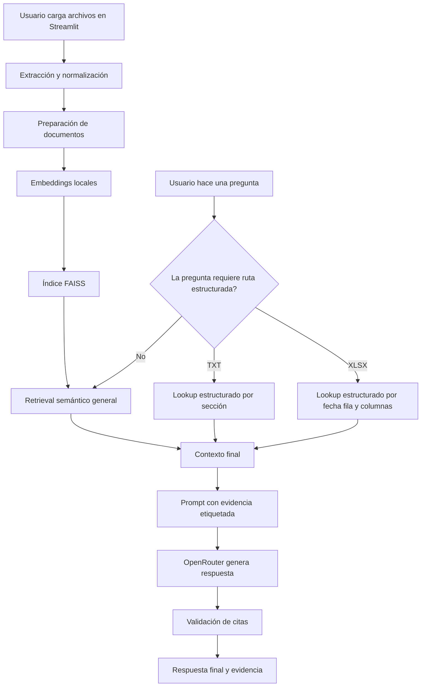
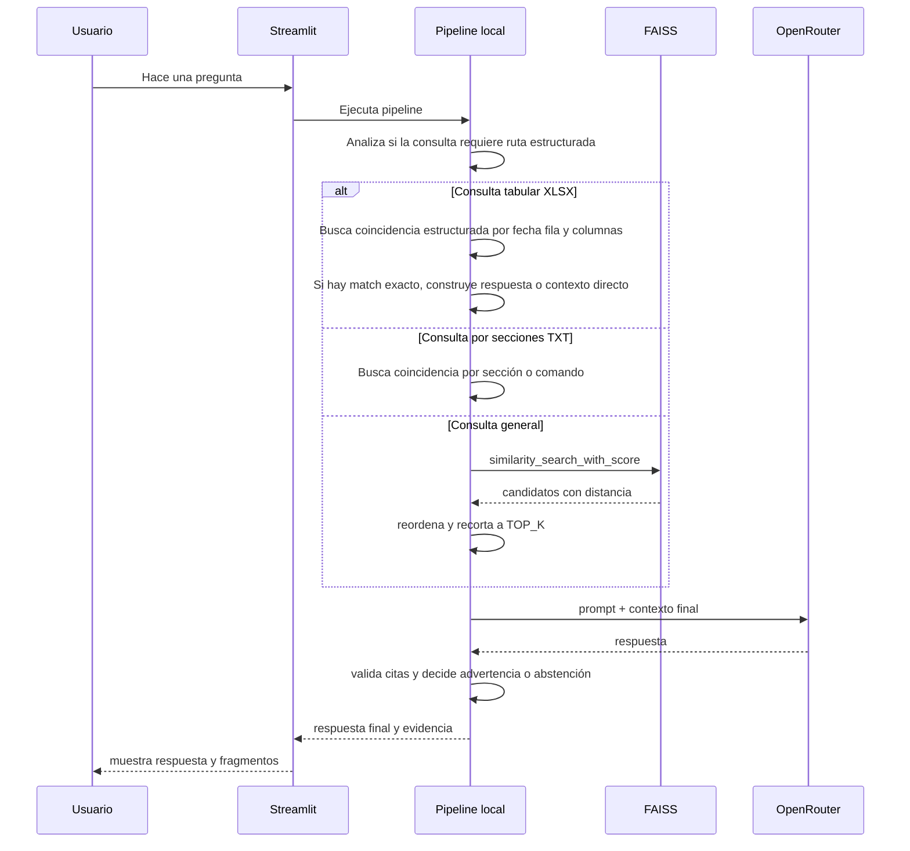

# RAG BIOS - Flujo del modelo

Este documento complementa el README principal y describe qué parte del sistema corre localmente y qué parte depende de OpenRouter.

## Vista general

La aplicación se organiza en tres bloques principales:

- ingesta y preparación documental
- recuperación de evidencia
- generación controlada de respuesta

## Flujo completo

## Dónde corre cada parte

## Flujo por pregunta

## Control de alucinaciones

El flujo actual reduce alucinaciones con varias barreras:

- solo se usa contexto recuperado desde FAISS o desde rutas estructuradas
- el modelo recibe evidencia etiquetada como `[E1]`, `[E2]`, etc.
- solo se envían al modelo los mejores `TOP_K`
- para `XLSX`, las preguntas exactas pueden resolverse sin depender del retrieval semántico
- para `TXT`, ciertas preguntas pueden resolverse desde la sección correspondiente
- si no hay evidencia suficiente, el sistema responde con abstención
- si faltan citas válidas, la aplicación conserva la evidencia recuperada para inspección

## Flujo de decisión de respuesta

## Costo y tokens en este flujo

- la sobre recuperación no incrementa por sí sola el costo del LLM porque ocurre en FAISS local
- el costo remoto depende sobre todo de `TOP_K`, `CHUNK_SIZE` y del tamaño real del contexto enviado
- el lookup estructurado de `XLSX` puede reducir costo porque evita mandar contexto innecesario al modelo
- las citas agregan pocos tokens extra frente al costo de enviar más contexto

## Mapeo a archivos del proyecto

- `app.py`: interfaz Streamlit, gestión de sesión y render de respuesta y evidencia
- `src/rag_bios/document_loader.py`: extracción y normalización de `PDF`, `DOCX`, `XLSX` y `TXT`
- `src/rag_bios/pipeline.py`: retrieval, lookup estructurado, armado de contexto y validación de citas
- `src/rag_bios/prompts.py`: reglas del prompt grounded
- `src/rag_bios/config.py`: parámetros de configuración del flujo
- `src/rag_bios/cache_store.py`: cache persistente del índice y documentos normalizados
