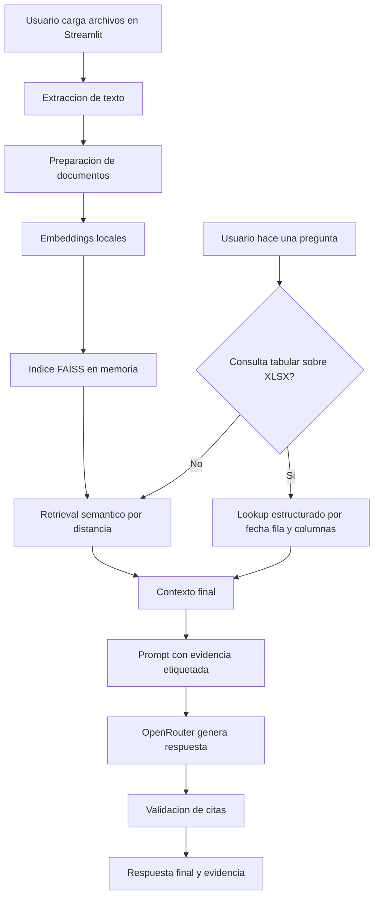
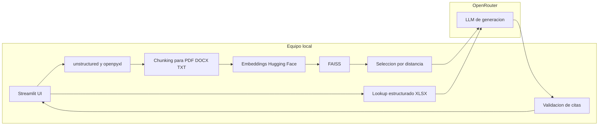
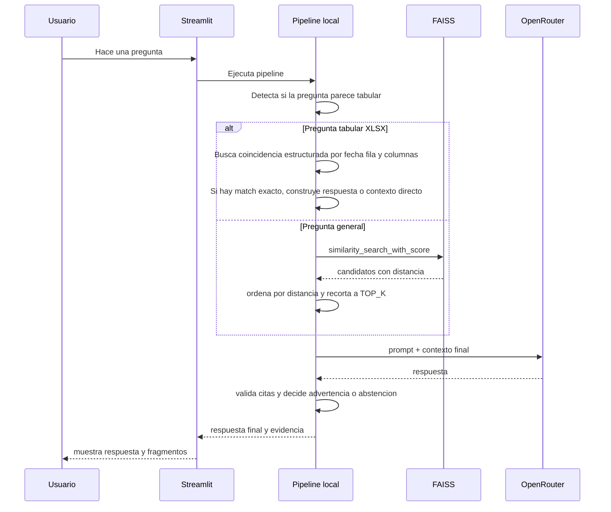
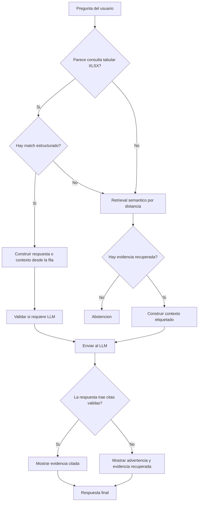

# RAG BIOS - Flujo del modelo

Este documento complementa el README principal y explica que parte del sistema corre localmente y que parte depende de OpenRouter.

## Vista general

La aplicacion tiene tres bloques principales:

- ingesta y preparacion de documentos
- recuperacion de evidencia
- generacion controlada de respuesta

## Flujo completo

## Donde corre cada parte

## Flujo por pregunta

## Control de alucinaciones

El flujo actual reduce alucinaciones con varias barreras:

- solo se usa contexto recuperado desde FAISS o desde lookup estructurado de XLSX
- el modelo recibe evidencia etiquetada como `[E1]`, `[E2]`, etc.
- solo se envian al modelo los mejores `TOP_K`
- para Excel, las preguntas exactas pueden resolverse sin depender del retrieval semantico
- si no hay evidencia suficiente, el sistema responde con abstencion
- si faltan citas validas, la aplicacion muestra advertencia y conserva la evidencia recuperada para inspeccion

## Flujo de decision de respuesta

## Costo y tokens en este flujo

- la sobre recuperacion no duplica por si sola el costo del LLM porque ocurre en FAISS local
- el costo remoto depende sobre todo de `TOP_K`, `CHUNK_SIZE` y del tamano real del contexto enviado
- el lookup estructurado de XLSX puede reducir costo porque evita mandar contexto innecesario al modelo
- las citas agregan pocos tokens extra en comparacion con enviar mas contexto

## Mapeo a archivos del proyecto

- `app.py`: interfaz Streamlit y render de respuesta y evidencia
- `src/rag_bios/document_loader.py`: extraccion de PDF, DOCX, XLSX y TXT
- `src/rag_bios/pipeline.py`: retrieval, lookup estructurado, armado de contexto y validacion de citas
- `src/rag_bios/prompts.py`: reglas del prompt grounded
- `src/rag_bios/config.py`: parametros de configuracion del flujo

## Como explicarlo en demo

Una forma simple de contarlo en la videollamada:

1. La aplicacion indexa documentos localmente con embeddings y FAISS.
2. Cuando el usuario pregunta, primero intenta recuperar evidencia local.
3. Si la pregunta es tabular sobre Excel, intenta resolverla con un camino estructurado mas preciso.
4. Solo despues llama al modelo remoto con contexto controlado, o responde directo si el lookup exacto ya resolvio el caso.
5. El LLM no es la fuente de verdad; la fuente de verdad son los documentos cargados y la evidencia mostrada en pantalla.
